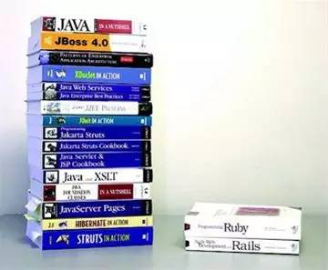

# Ruby 介绍

* 脚本语言，类似 python, js
* 彻底的面向对象的语言: 一切皆对象(没有原生类型和对象的区分)
* 单继承
* module(mixin)
* duck-typing(没有interface)
* sorbet: 静态类型标注(js, python都在朝这个方向改进)
* 强大(到失控)的元编程: 可以在运行时添加/修改/删除 类、方法

## 参考资料

* [Programming ruby](https://ruby-doc.com/docs/ProgrammingRuby/)
* ruby 元编程

* https://github.com/gauthamchandra/learning-ruby-from-js

## 社区

> Matz is nice and so we are nice

* [Ruby China](https://ruby-china.org/)
* [Rubygems.org](https://rubygems.org/)
* [Ruby Toolbox](https://www.ruby-toolbox.com/)

## 使用ruby的产品
* github
* gitlab
* zendesk
* shopify
* stripe
* homebrew
* vagrant
